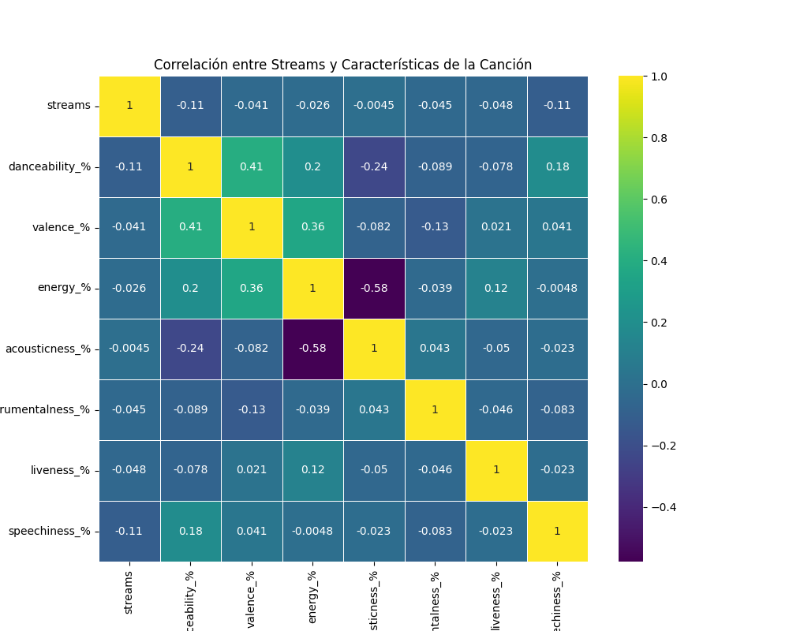
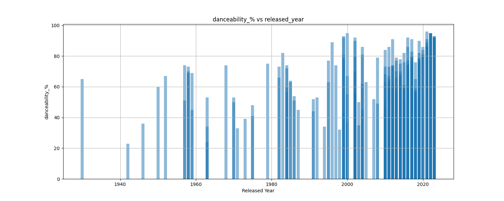
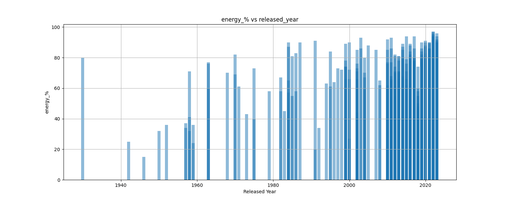
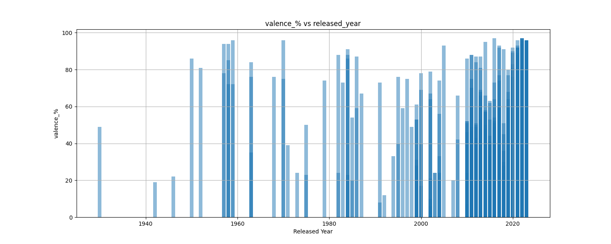
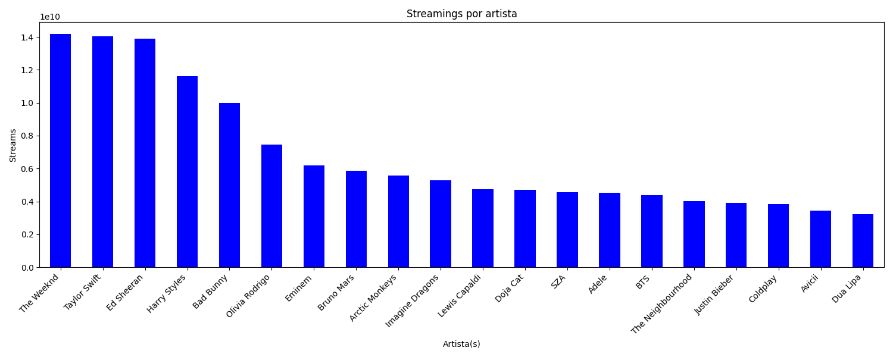
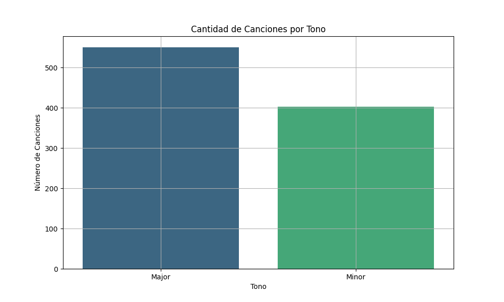
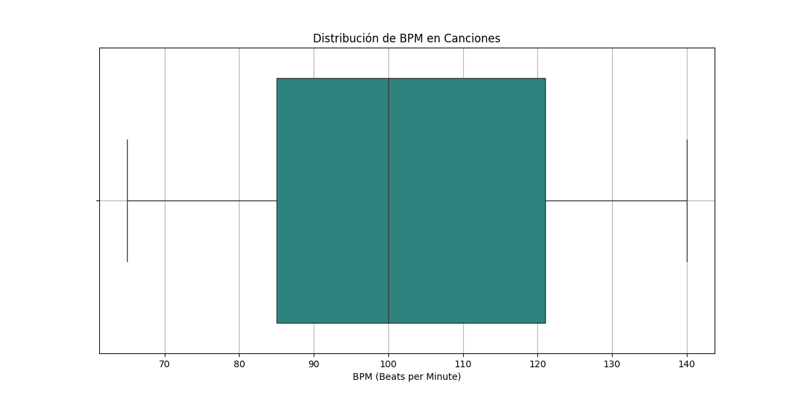

Comenzamos con una base de datos que incluye las mil canciones más famosas de Spotify, un conjunto con características dignas de interés y estudio. Algunas de ellas son las típicas que todo músico que ha explorado teoría musical conoce, como la tonalidad de la canción y el BPM. Además, Spotify asigna valores a otras características que también resultan fundamentales. Estas características incluyen:

Danceability (Bailabilidad): Describe qué tan adecuada es una pista para bailar basándose en elementos musicales como el tempo, la estabilidad rítmica, la fuerza del ritmo y la regularidad general.

Energy(Energía): Mide la intensidad y la actividad en una escala del 0.0 al 1.0. Las pistas energéticas suelen sentirse rápidas, fuertes y ruidosas, mientras que géneros más lentos, como un preludio de Bach, obtienen puntuaciones más bajas.

Speechiness(Habladuría): Detecta la presencia de palabras habladas en una pista, con valores que indican contenido similar a un discurso. Valores altos (superiores a 0.66) sugieren predominantemente palabras habladas, mientras que valores bajos (inferiores a 0.33) indican contenido principalmente musical.

Acousticness(Acustica): Una medida de confianza de 0.0 a 1.0 que indica si la pista es acústica, con 1.0 representando alta confianza.

Instrumentalness(instrumentalidad): Predice si una pista contiene vocales, con valores cercanos a 1.0 indicando una mayor probabilidad de ausencia de contenido vocal.

Liveness(Vivacidad): Detecta la presencia de una audiencia, con valores más altos indicando una probabilidad mayor de que la pista se haya interpretado en vivo.

Valence(Valencia): Medida en porcentaje en función de la positividad de la canción.

Todas estas características son porcentajes que proporcionan información comprensible sin necesidad de recibir clases de teoría musical. Es más fácil pensar en una canción bailable que en una más "mayor". Cualquier persona que pueda leer puede pensar en una canción con un alto porcentaje de bailabilidad, pero ¿cuántas personas pueden entender o pensar en canciones "mayores"?

Estamos explorando una forma nueva y diferente de describir una canción. Independientemente de si estos valores están bien o no puntuados, tienen un comportamiento que analizaremos a continuación para determinar la fórmula para crear una canción digna de estar en el TOP1000 de canciones de Spotify.

Lo primero que examinaremos es su comportamiento en relación con el número de reproducciones.

Acá podemos ver que a pesar de no tener un buén indicador de correlación la energía, valencia y bailabilidad son las que presentan mayor num. por lo que vamos a vamos a ver con especial atención estas para el desarrollo de nuestra formula.

Primero como es su comportamiento en el tiempo.

Con estas podemos ver que la tendencia hacia la decada 2020 la grán mayoria de estos valores están por encima de los 60%.

Tomamos nota de esto y ahora observamos quienes están en el top para analizar.

The Weekend, Taylor Swift, Ed Sheeran y Harry Styles, un canadiense, una americana y dos británicos sobresalen en el numero de streams ya que están por encima de los 10B de repdorucciones.

Otro aspecto que revela este gráfico es que el género predominante entre los artistas con más reproducciones es claramente el pop, ya que todos son artistas de este género, con la excepción de Eminem, Arctic Monkeys y The Neighbourhood. No obstante, incluso dentro de los géneros en los que pueden clasificarse, estos artistas forman parte de los más populares. Es decir, Eminem es un rapero, Arctic Monkeys han incursionado considerablemente en el pop-rock. Por lo tanto, también tomaremos nota de este detalle.

Ahora que tenemos cierta claridad sobre lo bailable, lo enérgico y lo positivo que debe ser nuestra fórmula, procedamos a analizar la teoría musical para examinar qué indican los datos sobre las tonalidades.

Con 120 canciones la tonalidad que ganó esta competencia es C#, tambíen puede ser nombrada como Db, en inglés y en español puede ser Do Sostenido o Re Bemol.

Ahora veamos que dice el dataset de la modealidad, si esa es mayor o menor.

La escala ganadora sería mayor, anotamos y vemos que dice acerca de los bpm.

ok vemos que el promedio está hacia los 100bpm.

Entonces resumimos:

La formula en base a los datos tomados para una canción digna de estr en el top 1000 de las canciones spotify sería:

Tonaidad: C# Mayor
Genero: POP
BPM: 100 
valencia > 60
Bailabilidad > 60
Energía > 60

Estás listo para crearla? Quieres entrar en el top 1000 de spotify del 2024?
Sabes cuantos de estos artistas vinieron a Chile este año?

Te dejo este Link de esta canción que hice yo tomando en consideracion la formula

LINK_DE_LA_CANCION

PAra analisis de este tipo y muchos otros más no dudes en contactarme